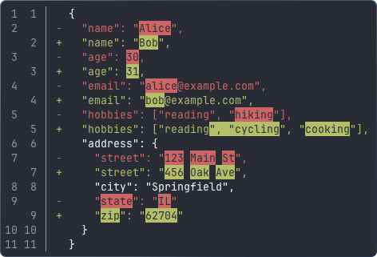
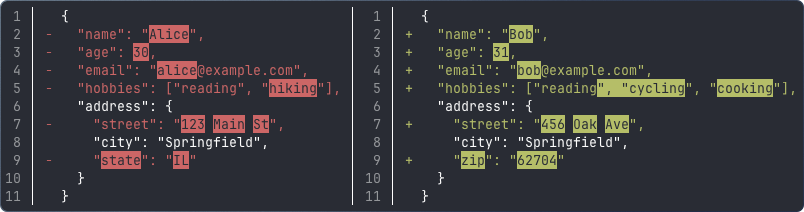

# go-delta

A Go library for rendering colored terminal diffs with word-level emphasis.

go-delta produces human-readable, unified or side-by-side diffs with ANSI colors. Changed segments are highlighted at the word level so you can see exactly what changed within each line - not just that a line changed.

**Inline:**



**Side-by-side:**



## Install

```
go get github.com/amterp/go-delta
```

## Quick Start

```go
import gd "github.com/amterp/go-delta"

// Simple diff with defaults
output := gd.Diff(old, new)

// Customized diff
output := gd.DiffWith(old, new,
    gd.WithSideBySide(true),
    gd.WithContextLines(5),
    gd.WithWidth(120),
)
```

`Diff` and `DiffWith` return an empty string when the inputs are identical.

## Options

| Option | Default | Description |
|---|---|---|
| `WithContextLines(n)` | 3 | Unchanged lines shown around each change |
| `WithSideBySide(on)` | false | Side-by-side layout instead of inline |
| `WithColor(on)` | auto | Force color on/off (auto-detects TTY) |
| `WithWidth(cols)` | auto | Terminal width for side-by-side mode |

Color auto-detection respects `NO_COLOR` and `FORCE_COLOR` environment variables.

## Features

- **Word-level emphasis** - changed words are highlighted within changed lines, not just the whole line
- **Two layouts** - inline (unified) or side-by-side
- **ANSI-aware** - correctly handles input that already contains ANSI escape codes
- **Wide character support** - CJK and other double-width characters are measured correctly
- **Smart line pairing** - modified lines are paired using a greedy forward-search algorithm (inspired by [Delta](https://github.com/dandavison/delta))
- **Hunk separators** - groups of changes are separated with context, just like unified diffs

## How It Works

go-delta runs a three-stage pipeline:

1. **Myers diff** - computes the minimal edit script between old and new
2. **Needleman-Wunsch alignment** - aligns tokens within changed line pairs to find word-level differences
3. **Rendering** - formats the output as inline or side-by-side with ANSI colors
